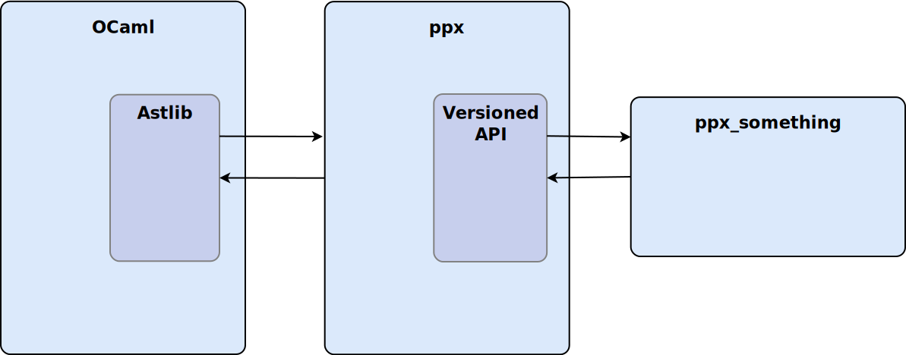

<!-- $theme: gaia -->

# The Future of PPX

### Towards a unified and more robust ecosystem

#

###### Nathan Rebours, Tarides
###### Jeremie Dimino, Jane Street
###### Carl Eastlund, Jane Street

---

## 
## 

---

## What is PPX?

---

## What is PPX?

#### Syntax extensions for PPXes

- Extension points:
```ocaml
let x = [%eq: int list] [1; 2] [2; 3]
```
- Attributes:
```ocaml
type t = int list [@@deriving eq]
```

---

## What is PPX?

#### Compiler integration

`ocamlc -ppx ppx foo.ml`


---

## What are the issues with PPX?

---

## What are the issues with PPX?

#### Combining several PPXes

`ocamlc -ppx ppx1 -ppx ppx2 -ppx ppx3 foo.ml`


---

## What are the issues with PPX?

#### Combining several PPXes

Is it equivalent to apply PPXes in different orders?


Issue for both PPX authors and users...

---

## ocaml-migrate-parsetree

---

## ocaml-migrate-parsetree

#### Driver


---

## ocaml-migrate-parsetree

#### Combining several PPXes

May involve a lot of AST migrations


---

## ocaml-migrate-parsetree

#### Combining several PPXes

Backward migrations can fail


---

## ocaml-migrate-parsetree

#### Combining several PPXes

The order is still an issue


---

## ppxlib

---

## ppxlib

- Recursively applies transformation to generated code.


```ocaml
let x = [%something ()] in
...
```
expands into
```ocaml
let x = 1 + [%something_else ()] in
...
```

---

## ppxlib

- Quality of life improvements

```ocaml
type t =
  { a : int
  ; b : string [@defualt "b"]
  }
[@@deriving make]
```

```
; b : string [@defualt "b"]
             ^^^^^^^^^^^^^^
Error: Uninterpreted attribute "defualt".
Hint: Did you mean "default"?
```

---

## ppxlib

#### Limitations

---

# Abstraction!

---

# API

```ocaml
module Ast_408 : sig
  type expression
  type case
  
  val pexp_match : expression -> case list -> expression
  ...
  
  type concrete_expression =
    | Pexp_match of expression * case list
    | ...
    
  val deconstruct_expression
    : expression -> concrete_expression
end
```

---


```ocaml
let%expect "foo" =
  let+ x = f 42 in
  ...
```

desugared:

```ocaml
[%expect
  let "foo" =
    let+ x = f 42 in
    ...
]
```

- ppx_expect uses `Ast_407`
- `let+` is a 4.08 feature

---

# Type equalities

```ocaml
module Ast_408 : sig
  type expression = Ast_407.expression
  type case = Ast_407.case
end
```

Good interop between ppx libraries


---

# Fully dynamic AST

```ocaml
x + y
```

#### Static representation

```ocaml
Add (Indent "x", Ident "y")
```

#### Dynamic representation

```ocaml
Term ("Add", [Term ("Ident", [String "x"]);
              Term ("Ident", [String "y"])
```

---

# Migration functions (Changelog)

---

# New flow


---

# Astlib

- dynamic AST
- changelog
- conversion to and from current Parsetree types

---

# Astlib



---

# The upgrading story

---

# Thanks!

##### https://github.com/NathanReb/future-of-ppx-talk